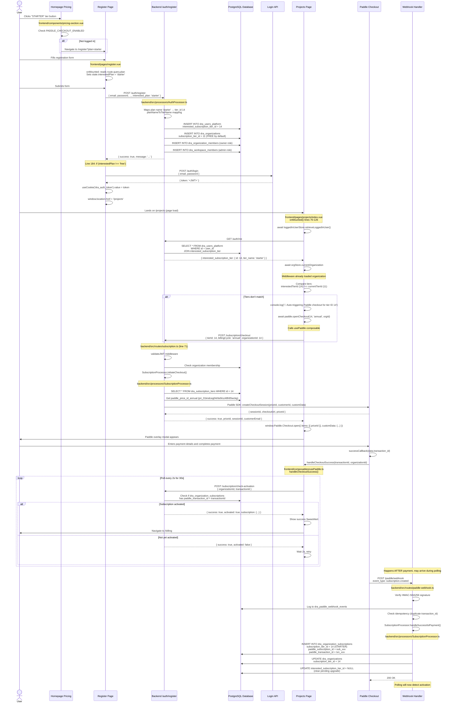
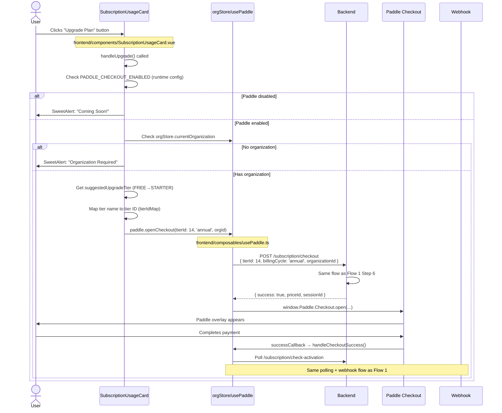
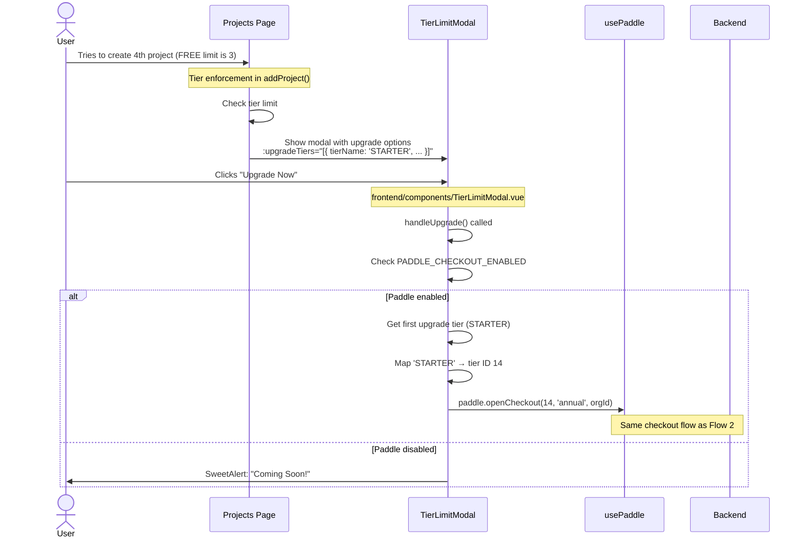
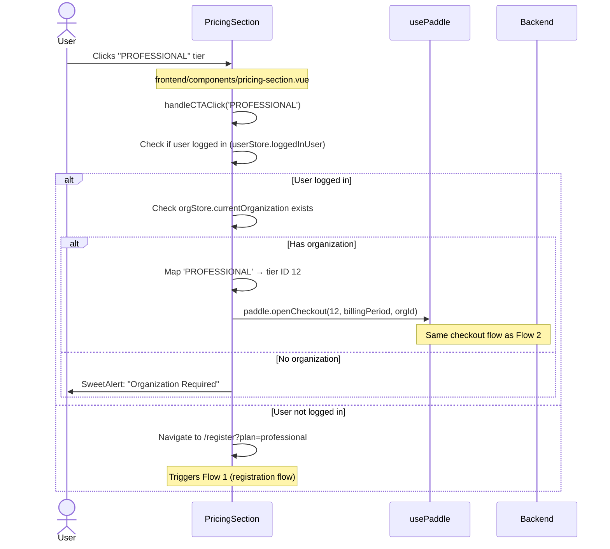

# Paddle Subscription Implementation - Complete Activity Diagram

## Overview
This document provides a comprehensive activity diagram of the Paddle payment integration implementation, showing both frontend and backend flows across different scenarios.

---

## Database Schema - Tier IDs (CRITICAL!)

**Actual Tier IDs in `dra_subscription_tiers` table:**
```
ID  | Tier Name
----|-------------------
11  | free
12  | professional
13  | enterprise
14  | starter
15  | professional_plus
```

**Frontend Tier Mapping (components):**
```typescript
const tierIdMap: Record<string, number> = {
    'FREE': 11,
    'STARTER': 14,
    'PROFESSIONAL': 12,
    'PROFESSIONAL PLUS': 15,
    'ENTERPRISE': 13
};
```

---

## Flow 1: New User Registration → Auto-Checkout



---

## Flow 2: Manual Upgrade Button Click (Already Logged In)



---

## Flow 3: Tier Limit Modal Upgrade



---

## Flow 4: Homepage Pricing Section (Logged In User)



---

## Backend Route Map

### Subscription Routes (`/subscription/*`)
| Method | Endpoint | Middleware | Purpose |
|--------|----------|------------|---------|
| GET | `/subscription/current` | validateJWT | Get user's current subscription & usage stats |
| GET | `/subscription/usage` | validateJWT | Get enhanced usage stats with tier flags |
| POST | `/subscription/checkout` | validateJWT, expensiveOperationsLimiter | Create Paddle checkout session |
| POST | `/subscription/check-activation` | validateJWT | Poll to check if subscription activated (after payment) |
| POST | `/subscription/portal-url` | validateJWT | Generate Paddle billing portal URL |

### Webhook Route (`/paddle/*`)
| Method | Endpoint | Middleware | Purpose |
|--------|----------|------------|---------|
| POST | `/paddle/webhook` | **NONE** (signature verified) | Receive Paddle events (subscription.created, payment_succeeded, etc.) |

### Auth Routes (Registration)
| Method | Endpoint | Middleware | Purpose |
|--------|----------|------------|---------|
| POST | `/auth/register` | publicLimiter | Register user with optional `interested_plan` parameter |
| POST | `/auth/login` | authLimiter | Login user, return JWT token |
| GET | `/auth/me` | validateJWT | Get logged-in user details (includes `interested_subscription_tier`) |

---

## Frontend Component Map

### Pages
- **`frontend/pages/register.vue`**: Captures `?plan=` query param, sends `interested_plan` to backend, auto-logs in for paid plans
- **`frontend/pages/projects/index.vue`**: Auto-triggers Paddle checkout if `interested_subscription_tier !== current_tier`
- **`frontend/pages/billing/index.vue`**: Shows subscription details, upgrade/manage buttons
- **`frontend/pages/index.vue`**: Homepage with pricing section

### Components
- **`frontend/components/pricing-section.vue`**: Pricing cards, handles tier selection, opens checkout or redirects to register
- **`frontend/components/SubscriptionUsageCard.vue`**: Usage meters, upgrade buttons, tier limits display
- **`frontend/components/TierLimitModal.vue`**: Shows when tier limit reached, suggests upgrade with Paddle checkout
- **`frontend/components/UsageMeter.vue`**: Individual usage progress bar (projects, data sources, etc.)

### Composables
- **`frontend/composables/usePaddle.ts`**: Core Paddle integration
  - `openCheckout(tierId, billingCycle, orgId)`: Calls backend `/subscription/checkout`, opens Paddle overlay
  - `handleCheckoutSuccess(transactionId, orgId)`: Polls `/subscription/check-activation` after payment
  - `manageBilling(orgId)`: Opens Paddle billing portal for payment method updates

### Stores
- **`frontend/stores/organizations.ts`**: Manages organizations, workspaces, `currentOrganization` computed alias
- **`frontend/stores/logged_in_user.ts`**: User data including `interested_subscription_tier`
- **`frontend/stores/subscription.ts`**: Subscription usage stats, auto-refresh polling

### Plugins
- **`frontend/plugins/paddle.client.ts`**: Loads Paddle SDK from CDN, initializes with `paddleClientToken` and `paddleEnvironment`

---

## Backend Processor Flow

### SubscriptionProcessor Key Methods

```typescript
// backend/src/processors/SubscriptionProcessor.ts

async initiateCheckout(orgId, tierId, billingCycle) {
    // 1. Fetch organization and tier from database
    // 2. Get paddle_price_id_monthly or paddle_price_id_annual
    // 3. Get or create Paddle customer
    // 4. Call PaddleService.createCheckoutSession()
    // 5. Return { sessionId, checkoutUrl, priceId, customerEmail }
}

async handleSuccessfulPayment(paddleData) {
    // Called by webhook handler
    // 1. Extract organizationId and tierId from customData
    // 2. Create or update dra_organization_subscriptions record
    // 3. Set paddle_subscription_id, paddle_transaction_id
    // 4. Update organization.subscription_tier_id
    // 5. Clear user.interested_subscription_tier_id (if matches)
    // 6. Return subscription record
}

async upgradeSubscription(orgId, newTierId) {
    // Manual upgrade via API (not implemented in current flows)
    // Would call Paddle API to update subscription
}

async getBillingPortalUrl(orgId) {
    // Generate Paddle billing portal session URL
    // Used by "Manage Subscription" button
}

async getSubscriptionDetails(orgId) {
    // Fetch subscription with tier details
    // Used by billing page
}
```

---

## Critical Environment Variables

### Frontend (`.env`)
```env
NUXT_PADDLE_CLIENT_TOKEN=test_8cc4dfcdc9e9de3e2afaf6889b9
NUXT_PADDLE_ENVIRONMENT=sandbox
NUXT_PADDLE_CHECKOUT_ENABLED=true  # Controls if Paddle shows or "Coming Soon"
NUXT_API_URL=http://backend.dataresearchanalysis.test:3002
```

### Backend (`.env`)
```env
PADDLE_API_KEY=pdl_sdbx_apikey_...
PADDLE_ENVIRONMENT=sandbox
PADDLE_WEBHOOK_SECRET=your_paddle_webhook_secret_here
PADDLE_VENDOR_ID=51560
```

---

## Key Database Tables

### `dra_subscription_tiers`
- Stores tier metadata (limits, pricing, Paddle IDs)
- **IDs**: 11=FREE, 12=PROFESSIONAL, 13=ENTERPRISE, 14=STARTER, 15=PROFESSIONAL_PLUS
- Columns: `paddle_price_id_monthly`, `paddle_price_id_annual`, `paddle_product_id`

### `dra_organization_subscriptions`
- One-to-one with `dra_organizations`
- Columns: `paddle_subscription_id`, `paddle_customer_id`, `paddle_transaction_id`, `subscription_tier_id`, `billing_cycle`, `is_active`, `cancelled_at`, `ends_at`, `grace_period_ends_at`

### `dra_users_platform`
- Column: `interested_subscription_tier_id` (nullable)
- Set during registration if `interested_plan` provided
- Cleared by webhook after successful payment

### `dra_paddle_webhook_events`
- Logs all webhook events for debugging and idempotency
- Columns: `event_type`, `payload` (jsonb), `processed`, `processed_at`, `error_message`

---

## Common Issues & Solutions

### Issue 1: "Organization Required" Dialog
**Cause**: `orgStore.currentOrganization` is `null` or `undefined`
**Solution**: 
- Added `currentOrganization` computed property to organizations store (alias for `selectedOrganization`)
- Middleware auto-loads organizations and auto-selects first one on login

### Issue 2: "Entity not found" for Tier ID
**Cause**: Frontend using tier IDs 1-5, database has 11-15
**Solution**: Updated all `tierIdMap` objects in components to match database IDs

### Issue 3: Paddle Overlay Not Opening
**Causes**:
1. `PADDLE_CHECKOUT_ENABLED` not loaded (missing `NUXT_` prefix)
2. Paddle SDK not loaded (check browser console for `📦 Loading Paddle SDK...`)
3. Frontend container not restarted after `.env` changes

**Solutions**:
1. Renamed all `PADDLE_*` env vars to `NUXT_PADDLE_*`
2. Restart frontend container: `docker restart frontend.dataresearchanalysis.test`
3. Hard refresh browser (Ctrl+Shift+R)

### Issue 4: Auto-Trigger Not Firing
**Cause**: User data doesn't have `interested_subscription_tier` loaded
**Solution**: 
- Backend `/auth/me` endpoint loads relation: `relations: ['interested_subscription_tier']`
- Projects page calls `loggedInUserStore.retrieveLoggedInUser()` before checking

### Issue 5: "Failed to create customer: Invalid request"
**Cause**: `DRAOrganization` model has **no email field** in database schema - code was passing empty string `organization.email || ''` to Paddle API
**Database Schema Reality**:
- Organizations table columns: `id`, `name`, `domain`, `logo_url`, `is_active`, `settings`, `created_at`, `updated_at`
- NO `email` or `owner_id` columns exist!
- Owner email must be retrieved via `dra_organization_members` join table

**Solution**: Load organization members relation and find owner's email
```typescript
// SubscriptionProcessor.initiateCheckout() - FIXED
const organization = await manager.findOneOrFail(DRAOrganization, {
    where: { id: organizationId },
    relations: ['subscription', 'subscription.subscription_tier', 'members', 'members.user']
});

// Get owner's email (organizations don't have email field)
const ownerMember = organization.members.find(m => m.role === 'owner');
if (!ownerMember || !ownerMember.user) {
    throw new Error('Organization owner not found');
}
const customerEmail = ownerMember.user.email;

// Now passes real email to Paddle
const customer = await paddle.createCustomer(customerEmail, organization.name, { organizationId });
```

**Key Learning**: Organizations are owned by users, not directly by emails. Access pattern is:
`Organization → members (DRAOrganizationMember[]) → user (DRAUsersPlatform) → email`

### Issue 6: "customer email conflicts with customer of id ctm_xxx"
**Cause**: Paddle already has a customer with this email from a previous checkout attempt, but local database doesn't have the `paddle_customer_id` saved
**Why it happens**: If previous checkout was cancelled/failed before webhook fired, customer was created in Paddle but not saved locally

**Solution**: Use try-create-catch pattern - attempt to create customer, extract existing ID from error if conflict occurs
```typescript
// PaddleService.getOrCreateCustomer() - ROBUST APPROACH
async getOrCreateCustomer(email: string, name: string, metadata?: Record<string, any>) {
    try {
        // Try to create customer
        const customer = await this.paddle.customers.create({ email, name, customData: metadata });
        return customer;
        
    } catch (error: any) {
        // If customer exists, extract ID from error message
        if (error.code === 'customer_already_exists') {
            // Error detail: "customer email conflicts with customer of id ctm_xxxxx"
            const match = error.detail.match(/customer of id (ctm_[a-z0-9]+)/i);
            
            if (match && match[1]) {
                const existingCustomerId = match[1];
                // Fetch and return existing customer
                return await this.paddle.customers.get(existingCustomerId);
            }
        }
        throw error;
    }
}
```

**SubscriptionProcessor Update** (simplified):
```typescript
// No need for manual search - getOrCreateCustomer handles everything
const customer = await paddle.getOrCreateCustomer(customerEmail, organization.name, { organizationId });
customerId = customer.id;

// Save to local database
if (!organization.subscription) {
    // Create subscription record with customer ID
} else {
    organization.subscription.paddle_customer_id = customerId;
    await manager.save(organization.subscription);
}
```

**Why This Works**: 
- Paddle's error message reliably includes the existing customer ID
- No need for search API (which may have pagination/delay issues)
- Atomic operation - create works OR we get the exact conflict ID
- More reliable than search which might return partial matches

---

## Paddle SDK Integration

### Plugin Initialization
```typescript
// frontend/plugins/paddle.client.ts
// Runs ONLY on client (browser)

1. Load Paddle.js from CDN: https://cdn.paddle.com/paddle/v2/paddle.js
2. Set environment: window.Paddle.Environment.set('sandbox')
3. Initialize: window.Paddle.Initialize({ token: clientToken })
4. Console logs: 
   - "📦 Loading Paddle SDK..."
   - "✅ Paddle SDK loaded"
   - "📘 Paddle initialized (environment: sandbox)"
```

### Checkout Flow
```typescript
window.Paddle.Checkout.open({
    items: [{ priceId: 'pri_01kndceg04r6e9rsz48h65wckg', quantity: 1 }],
    customer: { email: 'user@example.com' },
    customData: { 
        organizationId: 14,
        tierId: 14,
        billingCycle: 'annual'
    },
    successCallback: (data) => {
        // data.transaction_id available here
        // Start polling /subscription/check-activation
    },
    closeCallback: () => {
        console.log('User closed checkout without paying')
    }
});
```

---

## Testing the Complete Flow

### Test User Account
- **Email**: starter1@dataresearchanalysis.com
- **Password**: testuser
- **Organization ID**: 14
- **Current Tier**: FREE (id=11)
- **Interested Tier**: STARTER (id=14)

### Expected Behavior
1. Login → Auto-redirect to `/projects`
2. Console logs:
   ```
   🔍 Paddle checkout check: { hasUser: true, hasInterestedTier: true, ... }
   📊 Comparing tiers - Interested: 14, Current: 11
   🎯 Auto-triggering Paddle checkout for tier ID 14
   🛒 Opening Paddle checkout: { priceId: 'pri_...', sessionId: '...' }
   ```
3. Paddle overlay appears with STARTER Annual ($276)
4. (Sandbox) Complete test payment
5. Polling detects activation → Navigate to `/billing`
6. Webhook creates subscription record
7. Tier upgraded: FREE → STARTER

---

## Debugging Checklist

### Frontend
- [ ] Browser console shows Paddle SDK loaded: `📘 Paddle initialized (environment: sandbox)`
- [ ] Runtime config correct: `console.log(useRuntimeConfig().public.paddleCheckoutEnabled)` → `true`
- [ ] Organization loaded: `console.log(orgStore.currentOrganization)` → `{ id: 14, name: '...' }`
- [ ] User interested tier: `console.log(loggedInUserStore.getLoggedInUser()?.interested_subscription_tier)` → `{ id: 14, tier_name: 'starter' }`

### Backend
- [ ] Database tier IDs correct: `SELECT id, tier_name FROM dra_subscription_tiers;`
- [ ] User has interested tier: `SELECT interested_subscription_tier_id FROM dra_users_platform WHERE id = 20;` → `14`
- [ ] Organization has tier: `SELECT subscription_tier_id FROM dra_organizations WHERE id = 14;` → `11`
- [ ] Organization owner exists: `SELECT u.email FROM dra_users_platform u INNER JOIN dra_organization_members om ON om.users_platform_id = u.id WHERE om.organization_id = 14 AND om.role = 'owner';` → Should return owner email
- [ ] Paddle env vars set: `echo $PADDLE_API_KEY` (inside container)
- [ ] Webhook endpoint accessible: `curl -X POST http://backend:3002/paddle/webhook` (should return 401 signature error)

### Network
- [ ] Check browser Network tab for `POST /subscription/checkout` → Status 200
- [ ] Response contains `priceId`, `sessionId`, `customerEmail`
- [ ] No CORS errors
- [ ] Webhook logs in `dra_paddle_webhook_events` table after payment

---

## Summary

The Paddle integration is **fully implemented** with:
- ✅ Registration with interested plan tracking
- ✅ Auto-login for paid plans
- ✅ Auto-trigger Paddle checkout on projects page
- ✅ Manual upgrade buttons (3 locations)
- ✅ Tier limit modals with upgrade prompts
- ✅ Webhook handling for subscription activation
- ✅ Polling for real-time subscription status checks
- ✅ Billing portal integration
- ✅ Complete database schema with Paddle IDs

**Current Status**: All code correct, environment variables updated, tier IDs mapped. Ready for testing with Paddle sandbox account.
